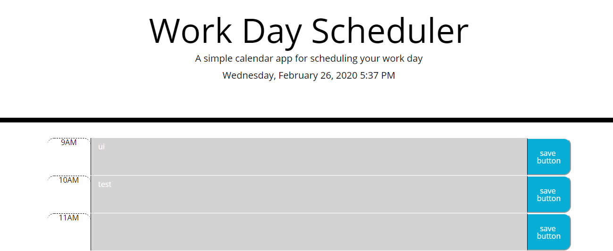

# Calendar HomeWork
First item. Made Html Css powered by JQuery
Second item. Put current time and date on top of calendar
third item. Made time blocks in calendar for business hours
Fourth item. color code indicated
Figth item. if you click time block you can enter events
sixth item. you can save text when you press save button

[Deployed Website](https://andrewjhrussell.github.io/CalendarWork/)

